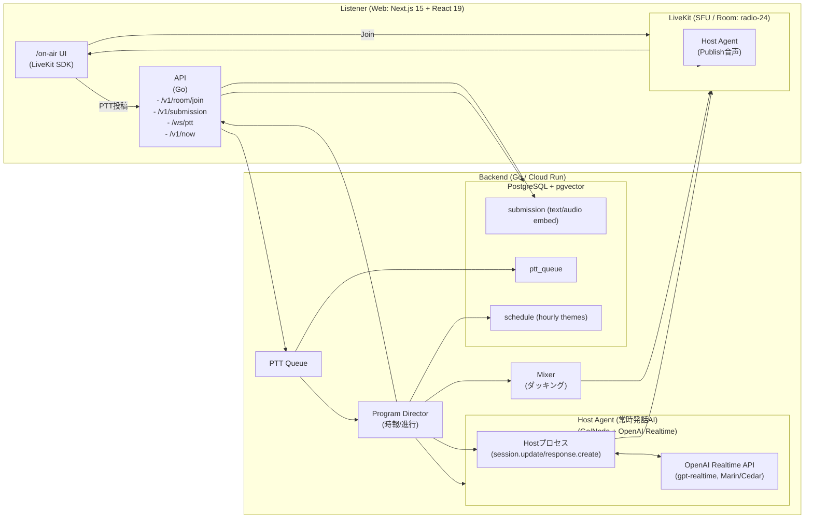

# Radio-24 - 24時間AIラジオ局

24時間放送のAIラジオ局。PTTで話しかけてAIが生声で応答します。

## 🚀 クイックスタート

### 方法1: ローカル開発環境

#### 1. 環境構築

```bash
# 完全な環境構築を実行
make setup

# または個別に実行
make setup-env    # 環境設定ファイル作成
make setup-db     # データベース起動・初期化
make setup-api    # APIサーバー依存関係インストール
make setup-web    # Webアプリ依存関係インストール
```

#### 2. 開発環境起動

```bash
# 全サービス起動（推奨）
make dev

# または個別起動
make dev-db       # データベースのみ
make dev-api      # APIサーバーのみ
make dev-web      # Webアプリのみ
```

#### 3. アクセス

- **Webアプリ**: <http://localhost:3000>
- **APIサーバー**: <http://localhost:8080>
- **データベース**: localhost:5432

### 方法2: Docker環境（推奨）

#### 1. Docker環境構築

```bash
# Docker環境を一発構築
make setup-docker

# または個別に実行
make docker-build  # Dockerイメージビルド
make docker-up     # 全サービス起動
```

#### 2. アクセス

- **Webアプリ**: <http://localhost:3000>
- **APIサーバー**: <http://localhost:8080>
- **データベース**: localhost:5432

#### 3. Docker管理コマンド

```bash
make docker-status   # サービス状態確認
make docker-logs     # ログ表示
make docker-restart  # サービス再起動
make docker-down     # サービス停止
make docker-clean    # 完全クリーンアップ
```

## 📋 利用可能なコマンド

### 環境構築

- `make setup` - 完全な環境構築
- `make setup-env` - 環境設定ファイル作成
- `make setup-db` - データベース起動・初期化
- `make setup-api` - APIサーバー依存関係インストール
- `make setup-web` - Webアプリ依存関係インストール

### 開発環境

- `make dev` - 開発環境起動（データベース + API + Web）
- `make dev-db` - データベースのみ起動
- `make dev-api` - APIサーバー起動
- `make dev-web` - Webアプリ起動
- `make dev-api-bg` - APIサーバーをバックグラウンド起動
- `make dev-web-bg` - Webアプリをバックグラウンド起動

### ビルド

- `make build` - 本番用ビルド実行
- `make build-api` - APIサーバービルド
- `make build-web` - Webアプリビルド

### Docker

- `make setup-docker` - Docker環境構築（推奨）
- `make docker-build` - Dockerイメージビルド
- `make docker-up` - Docker Composeで全サービス起動
- `make docker-down` - Docker Composeで全サービス停止
- `make docker-restart` - Docker Composeで全サービス再起動
- `make docker-logs` - Docker Composeのログ表示
- `make docker-status` - Docker Composeのサービス状態確認
- `make docker-clean` - Docker Composeのデータとボリューム削除

### テスト

- `make test` - 全テスト実行
- `make test-api` - APIサーバーテスト
- `make test-web` - Webアプリテスト

### データベース

- `make db-migrate` - データベースマイグレーション実行
- `make db-reset` - データベースリセット
- `make db-shell` - データベースシェル接続

### クリーンアップ

- `make clean` - 全クリーンアップ実行
- `make clean-build` - ビルド成果物削除
- `make clean-deps` - 依存関係削除
- `make clean-docker` - Docker関連クリーンアップ

### ユーティリティ

- `make status` - サービス状態確認
- `make logs` - ログ表示
- `make logs-api` - APIサーバーログ表示
- `make logs-web` - Webアプリログ表示
- `make logs-db` - データベースログ表示

### コード品質

- `make format` - コードフォーマット実行
- `make lint` - リンター実行
- `make check` - コード品質チェック実行

### デプロイ

- `make deploy` - デプロイ用ビルド実行
- `make deploy-staging` - ステージング環境デプロイ
- `make deploy-prod` - 本番環境デプロイ

## 🛠️ 技術スタック

### フロントエンド

- **Next.js 15** + **React 19** (App Router)
- **Chakra UI v3** - UIコンポーネントライブラリ
- **TypeScript** - 型安全な開発

### バックエンド

- **Go** - APIサーバー
- **PostgreSQL** + **pgvector** - ベクトルデータベース
- **OpenAI Realtime API** - WebRTC音声対話
- **OpenAI Embeddings API** - テキストベクトル化

### インフラ

- **Docker** + **Docker Compose** - 開発環境
- **Cloud Run** - デプロイ先

## 🔧 設定

### 環境変数

`.env` ファイルに以下の設定が必要です：

```bash
# OpenAI API
OPENAI_API_KEY=sk-your-api-key-here
OPENAI_REALTIME_MODEL=gpt-realtime
OPENAI_REALTIME_VOICE=marin

# データベース
POSTGRES_USER=postgres
POSTGRES_PASSWORD=postgres
POSTGRES_DB=radio24
POSTGRES_PORT=5432

# APIサーバー
API_PORT=8080
ALLOWED_ORIGIN=http://localhost:3000
```

### 必要なツール

- **Go 1.23+** - APIサーバー開発
- **Node.js 20+** - Webアプリ開発
- **pnpm** - パッケージマネージャー
- **Docker** - データベース環境

## 📁 プロジェクト構造

```
radio24/
├── apps/
│   └── web/                 # Next.js Webアプリ
├── services/
│   └── api/                 # Go APIサーバー
├── db/
│   ├── init/                # データベース初期化
│   └── migrations/          # マイグレーション
├── infra/
│   └── docker/              # Docker設定
├── docs/                    # ドキュメント
├── docker-compose.yml       # Docker Compose設定
├── Makefile                 # 開発用コマンド
└── README.md               # このファイル
```

## 🎯 主要機能

### 1. WebRTC音声対話

- **PTT (Push-to-Talk)** - ボタンを押しながら話しかける
- **リアルタイム音声応答** - AIが生声で応答
- **字幕表示** - 音声の内容をテキストで表示

### 2. 投稿システム

- **テキスト投稿** - ユーザーがテキストを投稿
- **ベクトル検索** - 類似した投稿を自動検索
- **レコメンド機能** - 関連する投稿を表示

### 3. テーマシステム

- **動的テーマ変更** - ラジオのテーマを動的に変更
- **背景色変更** - テーマに応じて背景色を変更

## 🚀 デプロイ

### Cloud Run へのデプロイ

```bash
# デプロイ用ビルド
make deploy

# ステージング環境
make deploy-staging

# 本番環境
make deploy-prod
```

## アーキテクチャ


## 🙏 謝辞

- [OpenAI](https://openai.com/) - Realtime API と Embeddings API
- [Chakra UI](https://chakra-ui.com/) - 美しいUIコンポーネント
- [Next.js](https://nextjs.org/) - 強力なReactフレームワーク
- [pgvector](https://github.com/pgvector/pgvector) - PostgreSQLベクトル拡張
