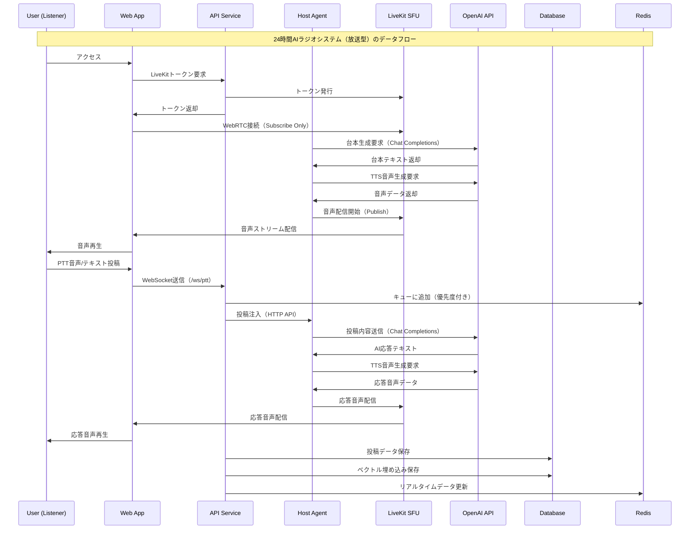
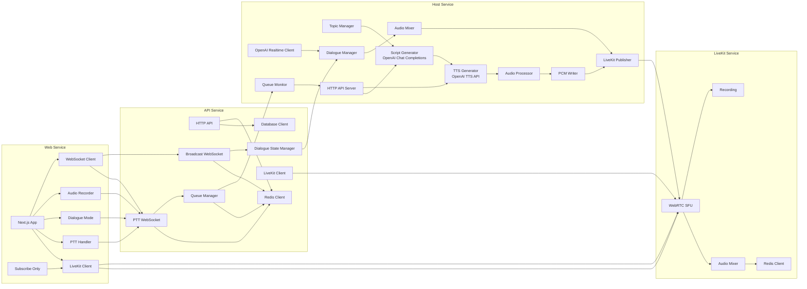

# アーキテクチャ図

## システム全体アーキテクチャ（放送型）

```mermaid
graph TB
    subgraph "Client Layer"
        WEB[Next.js Web App<br/>Port: 3000<br/>Subscribe Only]
        MOBILE[Mobile App<br/>PWA<br/>Subscribe Only]
    end
    
    subgraph "GCP Cloud Run Services"
        API[API Service<br/>Go<br/>Port: 8080<br/>1Gi RAM, 1 CPU<br/>Max: 10 instances<br/>PTT Queue Management]
        HOST[Host Service<br/>Go<br/>Port: 8080<br/>1Gi RAM, 1 CPU<br/>Fixed: 1 instance<br/>Script Generation & TTS<br/>24h Continuous Broadcast]
        LIVEKIT[LiveKit Service<br/>WebRTC SFU<br/>Port: 7880/7881<br/>2Gi RAM, 2 CPU<br/>Max: 3 instances<br/>Audio Distribution]
    end
    
    subgraph "Data Layer"
        DB[(Cloud SQL<br/>PostgreSQL 15<br/>pgvector extension<br/>10GB SSD<br/>CHANNEL/SCHEDULE/QUEUE)]
        REDIS[(Redis 7.0<br/>1GB<br/>Cache & Queue<br/>PTT Queue)]
    end
    
    subgraph "External Services"
        OPENAI[OpenAI API<br/>GPT-4o-mini (Script)<br/>TTS-1 (Speech)<br/>Chat Completions]
        STORAGE[Cloud Storage<br/>Backups & Media<br/>Recordings & Clips]
    end
    
    subgraph "Network"
        VPC[VPC Connector<br/>radio24-connector<br/>Min: 2, Max: 3]
        LB[Cloud Load Balancer<br/>HTTPS Termination]
    end
    
    %% Client connections (Subscribe Only)
    WEB --> LB
    MOBILE --> LB
    LB --> LIVEKIT
    LB --> API
    
    %% Service connections
    API --> DB
    API --> REDIS
    API --> LIVEKIT
    HOST --> LIVEKIT
    HOST --> OPENAI
    LIVEKIT --> REDIS
    
    %% PTT Flow
    WEB -.->|PTT Audio/Text| API
    API -.->|Queue Management| REDIS
    API -.->|PTT Injection| HOST
    
    %% Script Generation Flow
    HOST -.->|Script Generation| OPENAI
    HOST -.->|TTS Generation| OPENAI
    
    %% Data connections
    API --> STORAGE
    HOST --> STORAGE
    
    %% Network connections
    API --> VPC
    HOST --> VPC
    LIVEKIT --> VPC
    VPC --> DB
    VPC --> REDIS
```

## データフロー図（放送型）



## マイクロサービス間通信（放送型）



このアーキテクチャ図により、24時間AIラジオシステムの全体像と各コンポーネント間の関係を視覚的に理解できます。
