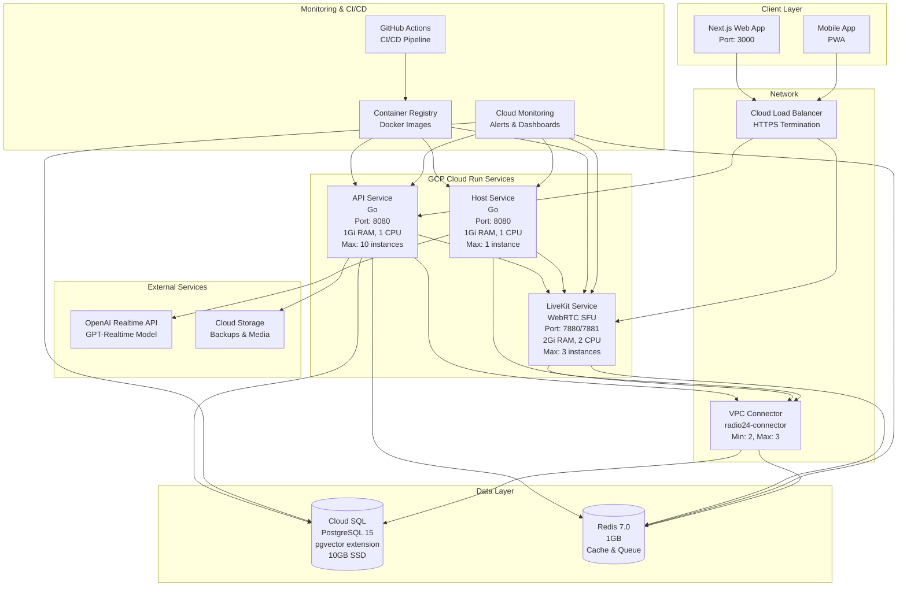
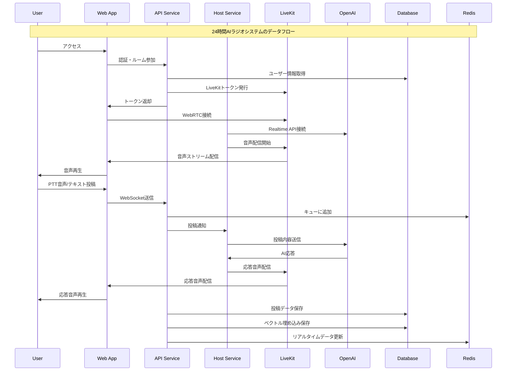
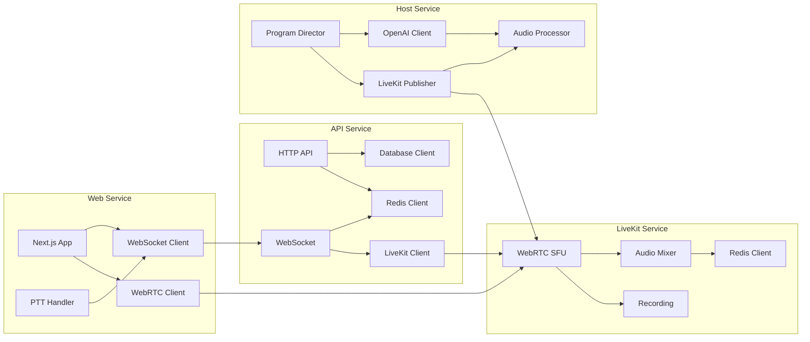
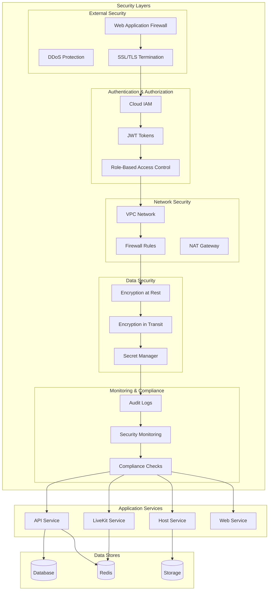
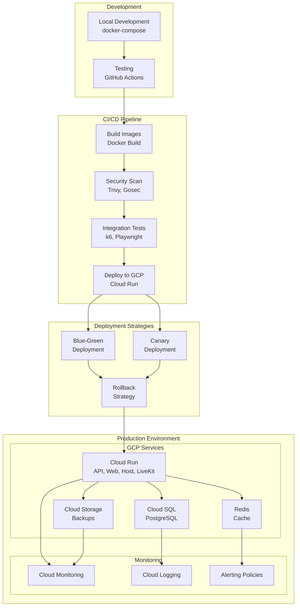
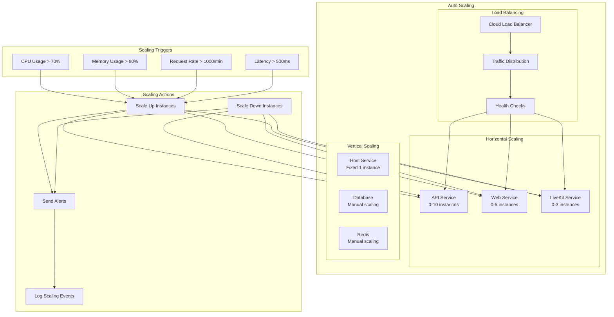
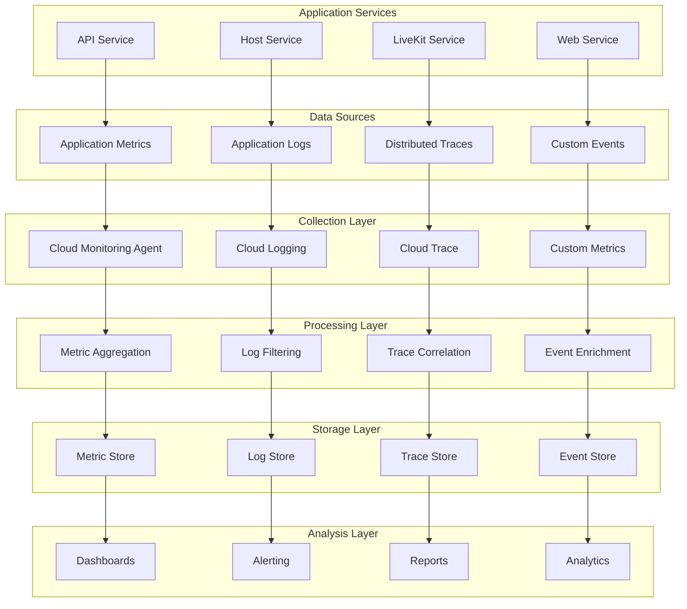
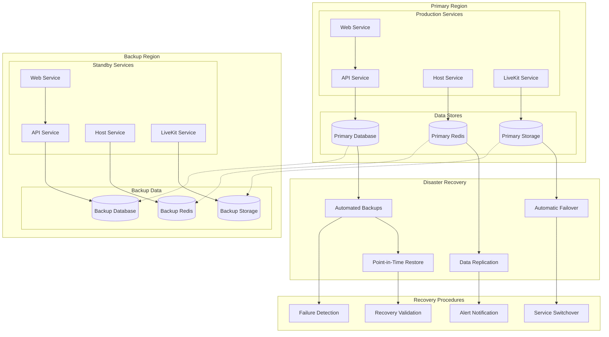

# アーキテクチャ図

## システム全体アーキテクチャ

## データフロー図

## マイクロサービス間通信

## セキュリティアーキテクチャ

## デプロイメントアーキテクチャ

## スケーリング戦略

## 監視・ログアーキテクチャ

## 災害復旧アーキテクチャ

このアーキテクチャ図により、24時間AIラジオシステムの全体像と各コンポーネント間の関係を視覚的に理解できます。
