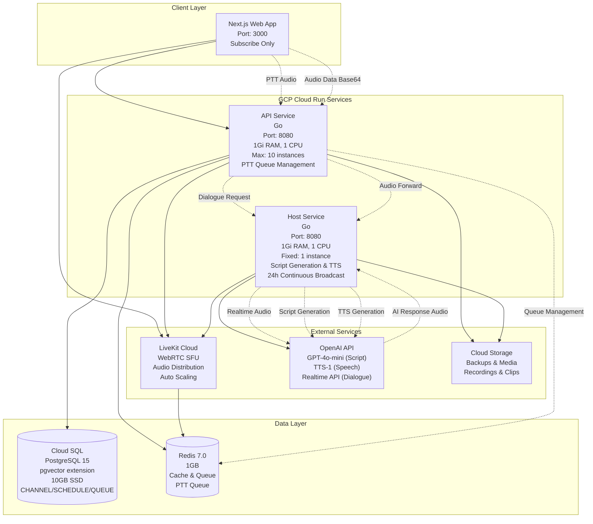
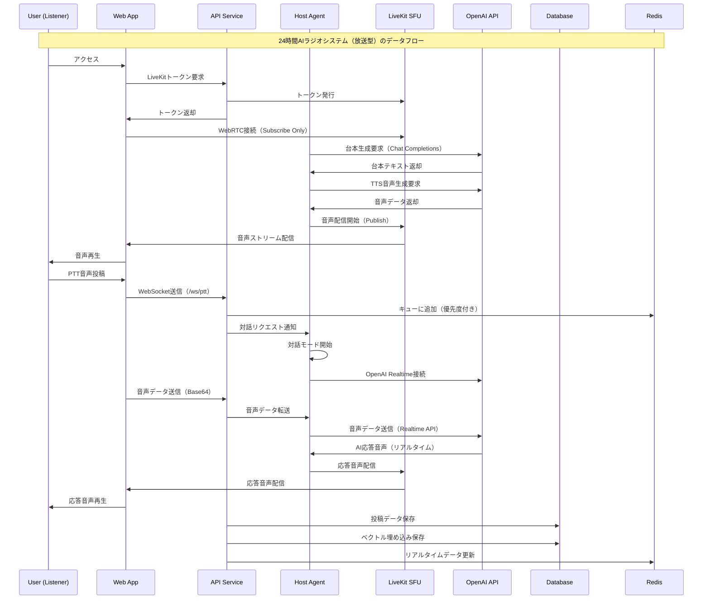
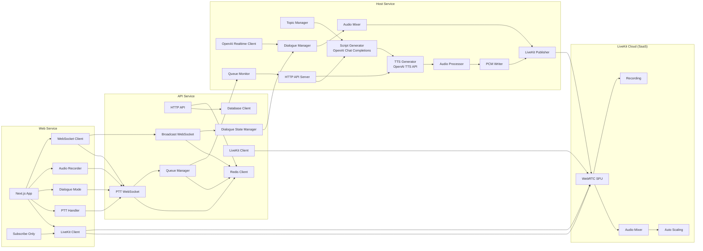

# アーキテクチャ図

## システム全体アーキテクチャ（放送型）

```mermaid
graph TB
    subgraph "Client Layer"
        WEB["Next.js Web App<br/>Port: 3000<br/>Subscribe Only"]
    end
    
    subgraph "GCP Cloud Run Services"
        API["API Service<br/>Go<br/>Port: 8080<br/>1Gi RAM, 1 CPU<br/>Max: 10 instances<br/>PTT Queue Management"]
        HOST["Host Service<br/>Go<br/>Port: 8080<br/>1Gi RAM, 1 CPU<br/>Fixed: 1 instance<br/>Script Generation & TTS<br/>24h Continuous Broadcast"]
    end
    
    subgraph "Data Layer"
        DB[("Cloud SQL<br/>PostgreSQL 15<br/>pgvector extension<br/>10GB SSD<br/>CHANNEL/SCHEDULE/QUEUE")]
        REDIS[("Redis 7.0<br/>1GB<br/>Cache & Queue<br/>PTT Queue")]
    end
    
    subgraph "External Services"
        LIVEKIT["LiveKit Cloud<br/>WebRTC SFU<br/>Audio Distribution<br/>Auto Scaling"]
        OPENAI["OpenAI API<br/>GPT-4o-mini (Script)<br/>TTS-1 (Speech)<br/>Realtime API (Dialogue)"]
        STORAGE["Cloud Storage<br/>Backups & Media<br/>Recordings & Clips"]
    end
    
    
    %% Client connections (Subscribe Only)
    WEB --> LIVEKIT
    WEB --> API
    
    %% Service connections
    API --> DB
    API --> REDIS
    API --> LIVEKIT
    HOST --> LIVEKIT
    HOST --> OPENAI
    LIVEKIT --> REDIS
    
    %% PTT Flow (Dialogue Mode)
    WEB -.->|PTT Audio| API
    API -.->|Queue Management| REDIS
    API -.->|Dialogue Request| HOST
    WEB -.->|Audio Data Base64| API
    API -.->|Audio Forward| HOST
    HOST -.->|Realtime Audio| OPENAI
    OPENAI -.->|AI Response Audio| HOST
    
    %% Script Generation Flow
    HOST -.->|Script Generation| OPENAI
    HOST -.->|TTS Generation| OPENAI
    
    %% Data connections
    API --> STORAGE
    HOST --> STORAGE
    
```

## データフロー図（放送型）

```mermaid
sequenceDiagram
    participant U as User (Listener)
    participant W as Web App
    participant A as API Service
    participant H as Host Agent
    participant L as LiveKit SFU
    participant O as OpenAI API
    participant D as Database
    participant R as Redis
    
    Note over U,R: 24時間AIラジオシステム（放送型）のデータフロー
    
    %% リスナー接続（Subscribe Only）
    U->>W: アクセス
    W->>A: LiveKitトークン要求
    A->>L: トークン発行
    A->>W: トークン返却
    W->>L: WebRTC接続（Subscribe Only）
    
    %% 常時放送（Host Agent）
    H->>O: 台本生成要求（Chat Completions）
    O->>H: 台本テキスト返却
    H->>O: TTS音声生成要求
    O->>H: 音声データ返却
    H->>L: 音声配信開始（Publish）
    L->>W: 音声ストリーム配信
    W->>U: 音声再生
    
    %% PTT投稿処理（対話モード）
    U->>W: PTT音声投稿
    W->>A: WebSocket送信（/ws/ptt）
    A->>R: キューに追加（優先度付き）
    A->>H: 対話リクエスト通知
    H->>H: 対話モード開始
    H->>O: OpenAI Realtime接続
    W->>A: 音声データ送信（Base64）
    A->>H: 音声データ転送
    H->>O: 音声データ送信（Realtime API）
    O->>H: AI応答音声（リアルタイム）
    H->>L: 応答音声配信
    L->>W: 応答音声配信
    W->>U: 応答音声再生
    
    %% データ保存
    A->>D: 投稿データ保存
    A->>D: ベクトル埋め込み保存
    A->>R: リアルタイムデータ更新
```

## マイクロサービス間通信（放送型）

```mermaid
graph LR
    subgraph "API Service"
        A1[HTTP API]
        A2[PTT WebSocket]
        A3[Broadcast WebSocket]
        A4[Database Client]
        A5[Redis Client]
        A6[LiveKit Client]
        A7[Queue Manager]
        A8[Dialogue State Manager]
    end
    
    subgraph "Host Service"
        H1[Script Generator<br/>OpenAI Chat Completions]
        H2[TTS Generator<br/>OpenAI TTS API]
        H3[LiveKit Publisher]
        H4[Audio Processor]
        H5[PCM Writer]
        H6[Topic Manager]
        H7[HTTP API Server]
        H8[OpenAI Realtime Client]
        H9[Queue Monitor]
        H10[Dialogue Manager]
        H11[Audio Mixer]
    end
    
    subgraph "LiveKit Cloud (SaaS)"
        L1[WebRTC SFU]
        L2[Audio Mixer]
        L3[Recording]
        L4[Auto Scaling]
    end
    
    subgraph "Web Service"
        W1[Next.js App]
        W2[LiveKit Client]
        W3[PTT Handler]
        W4[Subscribe Only]
        W5[Dialogue Mode]
        W6[Audio Recorder]
        W7[WebSocket Client]
    end
    
    %% API Service connections
    A1 --> A4
    A1 --> A5
    A2 --> A5
    A2 --> A7
    A3 --> A5
    A3 --> A8
    A6 --> L1
    A7 --> A5
    
    %% Host Service connections
    H6 --> H1
    H1 --> H2
    H2 --> H4
    H4 --> H5
    H5 --> H3
    H7 --> H1
    H7 --> H2
    H8 --> H10
    H9 --> H7
    H10 --> H11
    H11 --> H3
    
    %% LiveKit Cloud connections
    L1 --> L2
    L1 --> L3
    L2 --> L4
    
    %% Web Service connections
    W1 --> W2
    W1 --> W3
    W1 --> W5
    W1 --> W6
    W1 --> W7
    W3 --> A2
    W5 --> A2
    W6 --> A2
    W7 --> A2
    W7 --> A3
    W2 --> L1
    W4 --> W2
    
    %% Inter-service connections
    H3 --> L1
    W2 --> L1
    A7 --> H9
    A8 --> H10
```

このアーキテクチャ図により、24時間AIラジオシステムの全体像と各コンポーネント間の関係を視覚的に理解できます。
