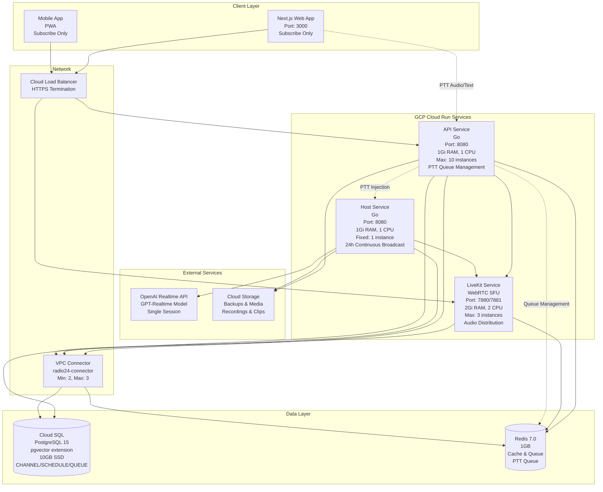
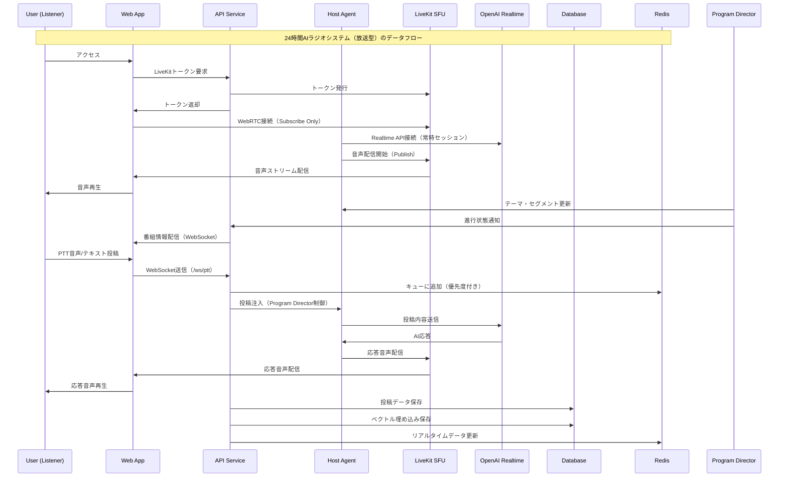
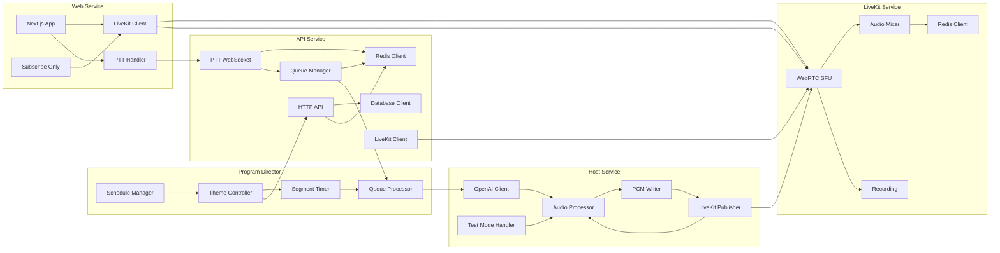
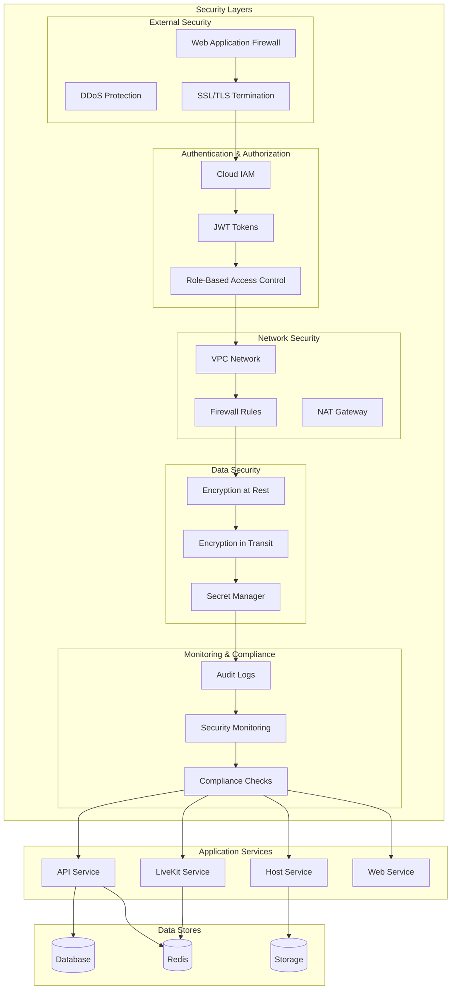
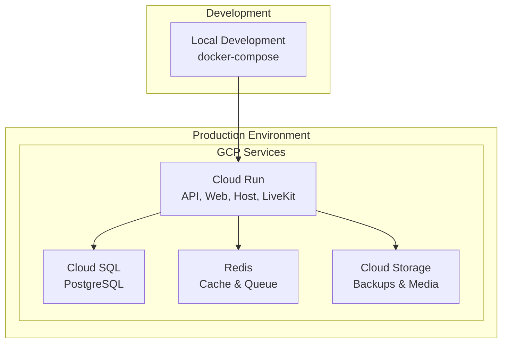
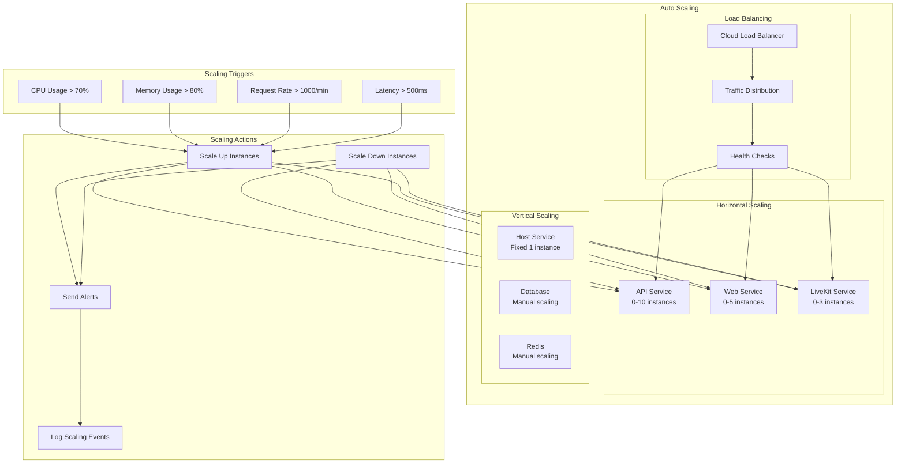

# アーキテクチャ図

## システム全体アーキテクチャ（放送型）

```mermaid
graph TB
    subgraph "Client Layer"
        WEB[Next.js Web App<br/>Port: 3000<br/>Subscribe Only]
        MOBILE[Mobile App<br/>PWA<br/>Subscribe Only]
    end
    
    subgraph "GCP Cloud Run Services"
        API[API Service<br/>Go<br/>Port: 8080<br/>1Gi RAM, 1 CPU<br/>Max: 10 instances<br/>PTT Queue Management]
        HOST[Host Service<br/>Go<br/>Port: 8080<br/>1Gi RAM, 1 CPU<br/>Fixed: 1 instance<br/>24h Continuous Broadcast]
        LIVEKIT[LiveKit Service<br/>WebRTC SFU<br/>Port: 7880/7881<br/>2Gi RAM, 2 CPU<br/>Max: 3 instances<br/>Audio Distribution]
    end
    
    subgraph "Data Layer"
        DB[(Cloud SQL<br/>PostgreSQL 15<br/>pgvector extension<br/>10GB SSD<br/>CHANNEL/SCHEDULE/QUEUE)]
        REDIS[(Redis 7.0<br/>1GB<br/>Cache & Queue<br/>PTT Queue)]
    end
    
    subgraph "External Services"
        OPENAI[OpenAI Realtime API<br/>GPT-Realtime Model<br/>Single Session]
        STORAGE[Cloud Storage<br/>Backups & Media<br/>Recordings & Clips]
    end
    
    subgraph "Network"
        VPC[VPC Connector<br/>radio24-connector<br/>Min: 2, Max: 3]
        LB[Cloud Load Balancer<br/>HTTPS Termination]
    end
    
    %% Client connections (Subscribe Only)
    WEB --> LB
    MOBILE --> LB
    LB --> LIVEKIT
    LB --> API
    
    %% Service connections
    API --> DB
    API --> REDIS
    API --> LIVEKIT
    HOST --> LIVEKIT
    HOST --> OPENAI
    LIVEKIT --> REDIS
    
    %% PTT Flow
    WEB -.->|PTT Audio/Text| API
    API -.->|Queue Management| REDIS
    API -.->|PTT Injection| HOST
    
    %% Data connections
    API --> STORAGE
    HOST --> STORAGE
    
    %% Network connections
    API --> VPC
    HOST --> VPC
    LIVEKIT --> VPC
    VPC --> DB
    VPC --> REDIS
```

## データフロー図（放送型）

```mermaid
sequenceDiagram
    participant U as User (Listener)
    participant W as Web App
    participant A as API Service
    participant H as Host Agent
    participant L as LiveKit SFU
    participant O as OpenAI Realtime
    participant D as Database
    participant R as Redis
    participant P as Program Director
    
    Note over U,R: 24時間AIラジオシステム（放送型）のデータフロー
    
    %% リスナー接続（Subscribe Only）
    U->>W: アクセス
    W->>A: LiveKitトークン要求
    A->>L: トークン発行
    A->>W: トークン返却
    W->>L: WebRTC接続（Subscribe Only）
    
    %% 常時放送（Host Agent）
    H->>O: Realtime API接続（常時セッション）
    H->>L: 音声配信開始（Publish）
    L->>W: 音声ストリーム配信
    W->>U: 音声再生
    
    %% 番組進行
    P->>H: テーマ・セグメント更新
    P->>A: 進行状態通知
    A->>W: 番組情報配信（WebSocket）
    
    %% PTT投稿処理
    U->>W: PTT音声/テキスト投稿
    W->>A: WebSocket送信（/ws/ptt）
    A->>R: キューに追加（優先度付き）
    A->>H: 投稿注入（Program Director制御）
    H->>O: 投稿内容送信
    O->>H: AI応答
    H->>L: 応答音声配信
    L->>W: 応答音声配信
    W->>U: 応答音声再生
    
    %% データ保存
    A->>D: 投稿データ保存
    A->>D: ベクトル埋め込み保存
    A->>R: リアルタイムデータ更新
```

## マイクロサービス間通信（放送型）

```mermaid
graph LR
    subgraph "API Service"
        A1[HTTP API]
        A2[PTT WebSocket]
        A3[Database Client]
        A4[Redis Client]
        A5[LiveKit Client]
        A6[Queue Manager]
    end
    
    subgraph "Host Service"
        H1[OpenAI Client]
        H2[LiveKit Publisher]
        H3[Audio Processor]
        H4[PCM Writer]
        H5[Test Mode Handler]
    end
    
    subgraph "Program Director"
        P1[Schedule Manager]
        P2[Theme Controller]
        P3[Segment Timer]
        P4[Queue Processor]
    end
    
    subgraph "LiveKit Service"
        L1[WebRTC SFU]
        L2[Audio Mixer]
        L3[Recording]
        L4[Redis Client]
    end
    
    subgraph "Web Service"
        W1[Next.js App]
        W2[LiveKit Client]
        W3[PTT Handler]
        W4[Subscribe Only]
    end
    
    %% API Service connections
    A1 --> A3
    A1 --> A4
    A2 --> A4
    A2 --> A6
    A5 --> L1
    A6 --> A4
    
    %% Host Service connections
    H1 --> H3
    H2 --> H3
    H3 --> H4
    H4 --> H2
    H5 --> H3
    
    %% Program Director connections
    P1 --> P2
    P2 --> P3
    P3 --> P4
    P4 --> H1
    
    %% LiveKit Service connections
    L1 --> L2
    L1 --> L3
    L2 --> L4
    
    %% Web Service connections
    W1 --> W2
    W1 --> W3
    W3 --> A2
    W2 --> L1
    W4 --> W2
    
    %% Inter-service connections
    H2 --> L1
    W2 --> L1
    A6 --> P4
    P2 --> A1
```

## セキュリティアーキテクチャ

```mermaid
graph TB
    subgraph "Security Layers"
        subgraph "External Security"
            WAF[Web Application Firewall]
            DDoS[DDoS Protection]
            SSL[SSL/TLS Termination]
        end
        
        subgraph "Authentication & Authorization"
            IAM[Cloud IAM]
            JWT[JWT Tokens]
            RBAC[Role-Based Access Control]
        end
        
        subgraph "Network Security"
            VPC[VPC Network]
            FW[Firewall Rules]
            NAT[NAT Gateway]
        end
        
        subgraph "Data Security"
            ENC[Encryption at Rest]
            TRANS[Encryption in Transit]
            SECRET[Secret Manager]
        end
        
        subgraph "Monitoring & Compliance"
            AUDIT[Audit Logs]
            MONITOR[Security Monitoring]
            COMPLIANCE[Compliance Checks]
        end
    end
    
    subgraph "Application Services"
        API[API Service]
        HOST[Host Service]
        LIVEKIT[LiveKit Service]
        WEB[Web Service]
    end
    
    subgraph "Data Stores"
        DB[(Database)]
        REDIS[(Redis)]
        STORAGE[(Storage)]
    end
    
    %% Security flow
    WAF --> SSL
    SSL --> IAM
    IAM --> JWT
    JWT --> RBAC
    RBAC --> VPC
    VPC --> FW
    FW --> ENC
    ENC --> TRANS
    TRANS --> SECRET
    SECRET --> AUDIT
    AUDIT --> MONITOR
    MONITOR --> COMPLIANCE
    
    %% Service connections
    COMPLIANCE --> API
    COMPLIANCE --> HOST
    COMPLIANCE --> LIVEKIT
    COMPLIANCE --> WEB
    
    %% Data connections
    API --> DB
    API --> REDIS
    HOST --> STORAGE
    LIVEKIT --> REDIS
```

## デプロイメントアーキテクチャ

```mermaid
graph TB
    subgraph "Development"
        DEV[Local Development<br/>docker-compose]
    end
    
    subgraph "Production Environment"
        subgraph "GCP Services"
            CR[Cloud Run<br/>API, Web, Host, LiveKit]
            SQL[Cloud SQL<br/>PostgreSQL]
            REDIS[Redis<br/>Cache & Queue]
            STORAGE[Cloud Storage<br/>Backups & Media]
        end
    end
    
    %% Development flow
    DEV --> CR
    
    %% Production flow
    CR --> SQL
    CR --> REDIS
    CR --> STORAGE
```

## スケーリング戦略

```mermaid
graph TB
    subgraph "Auto Scaling"
        subgraph "Horizontal Scaling"
            H1[API Service<br/>0-10 instances]
            H2[Web Service<br/>0-5 instances]
            H3[LiveKit Service<br/>0-3 instances]
        end
        
        subgraph "Vertical Scaling"
            V1[Host Service<br/>Fixed 1 instance]
            V2[Database<br/>Manual scaling]
            V3[Redis<br/>Manual scaling]
        end
        
        subgraph "Load Balancing"
            LB1[Cloud Load Balancer]
            LB2[Traffic Distribution]
            LB3[Health Checks]
        end
    end
    
    subgraph "Scaling Triggers"
        CPU[CPU Usage > 70%]
        MEMORY[Memory Usage > 80%]
        REQUESTS[Request Rate > 1000/min]
        LATENCY[Latency > 500ms]
    end
    
    subgraph "Scaling Actions"
        SCALE_UP[Scale Up Instances]
        SCALE_DOWN[Scale Down Instances]
        ALERT[Send Alerts]
        LOG[Log Scaling Events]
    end
    
    %% Trigger flow
    CPU --> SCALE_UP
    MEMORY --> SCALE_UP
    REQUESTS --> SCALE_UP
    LATENCY --> SCALE_UP
    
    %% Action flow
    SCALE_UP --> H1
    SCALE_UP --> H2
    SCALE_UP --> H3
    SCALE_DOWN --> H1
    SCALE_DOWN --> H2
    SCALE_DOWN --> H3
    
    %% Load balancing
    LB1 --> LB2
    LB2 --> LB3
    LB3 --> H1
    LB3 --> H2
    LB3 --> H3
    
    %% Monitoring
    SCALE_UP --> ALERT
    SCALE_DOWN --> ALERT
    ALERT --> LOG
```

このアーキテクチャ図により、24時間AIラジオシステムの全体像と各コンポーネント間の関係を視覚的に理解できます。
