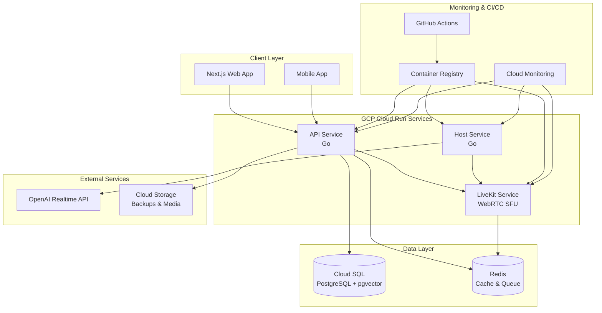

# インフラ構成ドキュメント

## 概要

24時間AIラジオシステムのインフラ構成について説明します。このシステムはGoogle Cloud Platform (GCP)上で動作し、マイクロサービスアーキテクチャを採用しています。

## アーキテクチャ概要



## サービス構成

### 1. API Service (Go)

- **役割**: メインのAPIサーバー
- **ポート**: 8080
- **リソース**: 1Gi RAM, 1 CPU
- **最大インスタンス**: 10
- **機能**:
  - ユーザー認証・管理
  - 投稿の受付・管理
  - 番組進行の制御
  - LiveKitトークンの発行
  - WebSocket接続の管理

### 2. Host Service (Go)

- **役割**: AI DJの常時発話サービス
- **ポート**: 8080
- **リソース**: 1Gi RAM, 1 CPU
- **最大インスタンス**: 1 (常時起動)
- **機能**:
  - OpenAI Realtime APIとの接続
  - 24時間連続音声生成
  - LiveKitへの音声配信
  - 番組進行の実行

### 3. LiveKit Service (WebRTC SFU)

- **役割**: リアルタイム音声配信の中継
- **ポート**: 7880 (HTTP), 7881 (UDP)
- **リソース**: 2Gi RAM, 2 CPU
- **最大インスタンス**: 3
- **機能**:
  - WebRTC音声ストリーミング
  - 複数ユーザーの同時接続
  - 音声ミキシング・ダッキング
  - 録音・クリップ生成

### 4. Web Service (Next.js)

- **役割**: フロントエンドアプリケーション
- **ポート**: 3000
- **リソース**: 512Mi RAM, 1 CPU
- **最大インスタンス**: 5
- **機能**:
  - ユーザーインターフェース
  - リアルタイム音声再生
  - PTT (Push-to-Talk) 機能
  - 投稿・コメント機能

## データベース構成

### Cloud SQL (PostgreSQL)

- **バージョン**: PostgreSQL 15
- **インスタンス**: db-f1-micro
- **ストレージ**: 10GB SSD (自動拡張)
- **リージョン**: asia-northeast1
- **拡張機能**: pgvector (ベクトル検索用)

#### テーブル構成

```sql
-- 投稿管理
CREATE TABLE submission (
    id UUID PRIMARY KEY DEFAULT gen_random_uuid(),
    user_id TEXT,
    type TEXT CHECK (type IN ('text', 'audio')) NOT NULL,
    text TEXT,
    embed VECTOR(1536),  -- OpenAI埋め込みベクトル
    created_at TIMESTAMPTZ DEFAULT now()
);

-- ベクトル検索用インデックス
CREATE INDEX submission_embed_hnsw ON submission 
USING hnsw (embed vector_cosine_ops);
```

### Redis

- **バージョン**: Redis 7.0
- **サイズ**: 1GB
- **リージョン**: asia-northeast1
- **用途**:
  - セッション管理
  - キャッシュ
  - キュー管理
  - リアルタイムデータ

## ネットワーク構成

### VPC Connector

- **名前**: radio24-connector
- **リージョン**: asia-northeast1
- **最小インスタンス**: 2
- **最大インスタンス**: 3
- **用途**: Cloud RunとVPC内リソースの接続

### セキュリティ

- **認証**: Cloud Run IAM
- **HTTPS**: 全サービスでHTTPS強制
- **CORS**: 適切なオリジン設定
- **シークレット管理**: GitHub Secrets + Cloud Secret Manager

## デプロイメント構成

### CI/CD Pipeline

- **プラットフォーム**: GitHub Actions
- **レジストリ**: Google Container Registry
- **デプロイ戦略**: Blue-Green Deployment
- **自動テスト**: 単体・統合・E2Eテスト

### 環境変数

```bash
# API Service
POSTGRES_HOST=radio24-db
POSTGRES_PORT=5432
POSTGRES_USER=radio24-user
POSTGRES_PASSWORD=***
POSTGRES_DB=radio24
OPENAI_API_KEY=***
LIVEKIT_API_KEY=***
LIVEKIT_API_SECRET=***

# Host Service
LIVEKIT_API_KEY=***
LIVEKIT_API_SECRET=***
OPENAI_API_KEY=***
LIVEKIT_WS_URL=wss://livekit-***.run.app

# Web Service
NEXT_PUBLIC_API_BASE=https://api-***.run.app
NEXT_PUBLIC_OPENAI_REALTIME_MODEL=gpt-realtime
```

## 監視・運用

### Cloud Monitoring

- **アラート**: エラー率、レイテンシ、リソース使用率
- **ログ**: 構造化ログの集約・分析
- **メトリクス**: カスタムメトリクスの収集
- **ダッシュボード**: リアルタイム監視

### バックアップ

- **データベース**: 日次自動バックアップ
- **ストレージ**: Cloud Storageへのエクスポート
- **保持期間**: 30日間

### セキュリティ

- **脆弱性スキャン**: Trivy, Gosec, npm audit
- **シークレット検出**: ハードコードされた秘密の検出
- **コンプライアンス**: 定期的なセキュリティチェック

## スケーリング戦略

### 水平スケーリング

- **API Service**: 負荷に応じて0-10インスタンス
- **Web Service**: 負荷に応じて0-5インスタンス
- **LiveKit Service**: 負荷に応じて0-3インスタンス

### 垂直スケーリング

- **Host Service**: 常時1インスタンス（固定）
- **データベース**: 必要に応じてインスタンスサイズ変更

## コスト最適化

### リソース最適化

- **最小インスタンス**: 不要なサービスは0に設定
- **CPU割り当て**: 用途に応じた適切な割り当て
- **メモリ使用量**: 効率的なメモリ管理

### 使用量監視

- **コスト分析**: 月次コストレポート
- **未使用リソース**: 定期的なクリーンアップ
- **最適化提案**: 自動的な推奨事項

## 災害復旧

### バックアップ戦略

- **データベース**: 日次バックアップ + ポイントインタイム復旧
- **設定**: Infrastructure as Code
- **アプリケーション**: コンテナイメージのバージョン管理

### 復旧手順

1. バックアップからのデータベース復旧
2. 最新のコンテナイメージでのサービス再デプロイ
3. 設定の復元と検証
4. 監視の再設定

## セキュリティ考慮事項

### データ保護

- **暗号化**: 転送時・保存時の暗号化
- **アクセス制御**: IAMによる細かい権限管理
- **監査ログ**: 全操作のログ記録

### コンプライアンス

- **GDPR**: 個人データの適切な処理
- **セキュリティ**: 定期的なセキュリティ監査
- **可用性**: 99.9%の可用性目標

## 運用ガイド

### デプロイメント

1. コードのmainブランチへのプッシュ
2. GitHub Actionsによる自動テスト
3. コンテナイメージのビルド・プッシュ
4. Cloud Runへの自動デプロイ
5. ヘルスチェック・監視の確認

### トラブルシューティング

- **ログ確認**: Cloud Loggingでの詳細ログ
- **メトリクス**: Cloud Monitoringでのパフォーマンス分析
- **アラート**: 設定されたアラートの確認
- **ロールバック**: 前バージョンへの迅速な復旧

### メンテナンス

- **定期更新**: 依存関係の自動更新
- **セキュリティパッチ**: 緊急パッチの適用
- **パフォーマンス**: 定期的な最適化

## 今後の拡張計画

### 機能拡張

- **マルチリージョン**: 複数リージョンでの展開
- **CDN**: Cloud CDNの導入
- **AI機能**: より高度なAI機能の追加

### 技術改善

- **マイクロサービス**: さらなるサービス分割
- **イベント駆動**: イベント駆動アーキテクチャの採用
- **リアルタイム**: より低遅延の実現
