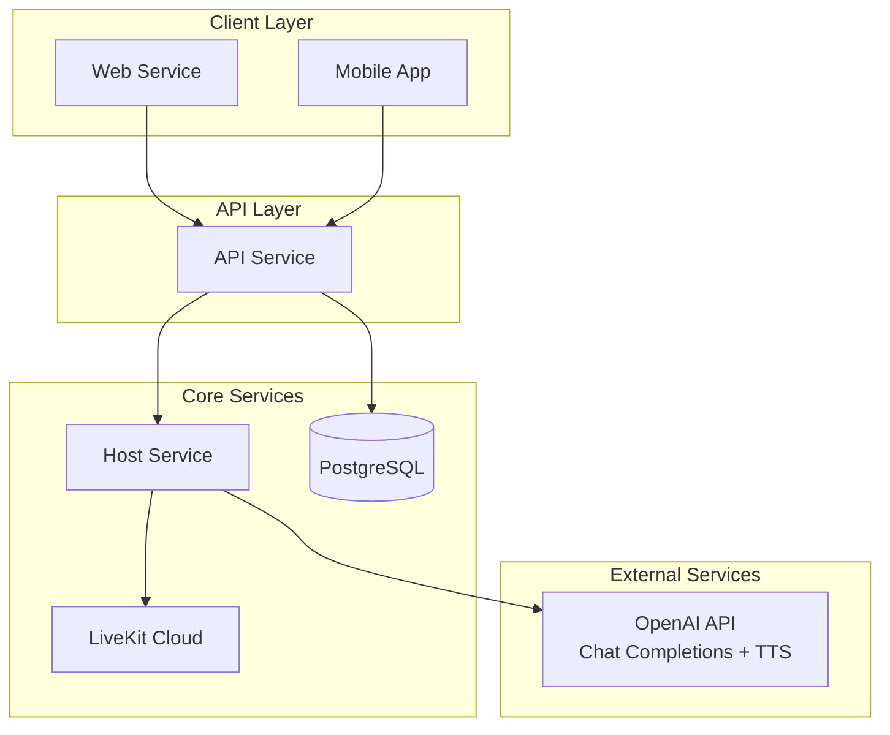

# マイクロサービスアーキテクチャ

## 概要

Radio24プロジェクトをマイクロサービスアーキテクチャに移行し、各サービスを独立して開発・デプロイ・スケールできるようにしました。

## サービス構成

### 1. API Service (Port: 8080)

- **責任**: REST API、WebSocket配信、PTT管理
- **機能**:
  - LiveKitトークン発行
  - PTT WebSocket接続
  - 投稿キュー管理
  - WebSocket配信（Broadcast Hub）
  - Host Serviceとの通信

### 2. Host Service (Port: 8082)

- **責任**: AI Host Agent、台本生成、音声配信
- **機能**:
  - 台本自動生成（8つのトピックを循環）
  - OpenAI Chat Completions API接続
  - OpenAI TTS API接続
  - LiveKit音声配信
  - HTTP API（台本生成・即座発話）

### 3. Web Service (Port: 3000)

- **責任**: フロントエンド
- **機能**:
  - Next.js 15 + React 19
  - LiveKit接続
  - PTT機能
  - 番組情報表示

## 通信フロー



## データベーススキーマ

### CHANNEL

```sql
CREATE TABLE channel (
    id UUID PRIMARY KEY DEFAULT gen_random_uuid(),
    name TEXT NOT NULL UNIQUE,
    live BOOLEAN DEFAULT true,
    started_at TIMESTAMPTZ DEFAULT now()
);
```

### SCHEDULE

```sql
CREATE TABLE schedule (
    id UUID PRIMARY KEY DEFAULT gen_random_uuid(),
    channel_id UUID REFERENCES channel(id) ON DELETE CASCADE,
    hour INTEGER CHECK (hour >= 0 AND hour <= 23),
    block TEXT CHECK (block IN ('OP', 'NEWS', 'QANDA', 'MUSIC', 'TOPIC_A', 'JINGLE')) NOT NULL,
    prompt TEXT,
    created_at TIMESTAMPTZ DEFAULT now()
);
```

### QUEUE

```sql
CREATE TABLE queue (
    id UUID PRIMARY KEY DEFAULT gen_random_uuid(),
    user_id TEXT,
    kind TEXT CHECK (kind IN ('audio', 'text', 'phone')) NOT NULL,
    text TEXT,
    meta JSONB,
    enqueued_at TIMESTAMPTZ DEFAULT now(),
    status TEXT CHECK (status IN ('queued', 'live', 'done', 'dropped')) DEFAULT 'queued'
);
```

## API エンドポイント

### API Service

- `GET /health` - ヘルスチェック
- `GET /ws/ptt` - PTT WebSocket
- `GET /ws/broadcast` - 配信WebSocket
- `POST /v1/room/join` - LiveKit接続トークン

### Host Service

- `GET /health` - ヘルスチェック
- `POST /script/generate` - 台本生成
- `POST /speak` - 即座に発話

## 環境変数

### API Service

```bash
POSTGRES_HOST=db
POSTGRES_PORT=5432
POSTGRES_USER=postgres
POSTGRES_PASSWORD=postgres
POSTGRES_DB=radio24
LIVEKIT_API_KEY=devkey
LIVEKIT_API_SECRET=secret
OPENAI_API_KEY=your-key
ALLOWED_ORIGIN=http://localhost:3000
```

### Host Service

```bash
LIVEKIT_API_KEY=devkey
LIVEKIT_API_SECRET=secret
LIVEKIT_WS_URL=ws://livekit:7880
OPENAI_API_KEY=your-key
OPENAI_REALTIME_MODEL=gpt-realtime
OPENAI_REALTIME_VOICE=marin
```

## デプロイメント

### Docker Compose (開発環境)

```bash
docker-compose up -d
```

### Google Cloud Run (本番環境)

```bash
gcloud builds submit --config cloudbuild/cloudbuild.yaml
```

## 利点

### 1. 責任の分離

- 各サービスが明確な責任を持つ
- 単一責任の原則に従った設計

### 2. スケーラビリティ

- 各サービスを独立してスケール
- リソース使用量に応じた最適化

### 3. 可用性

- 一つのサービスが落ちても他に影響しない
- 障害の影響範囲を限定

### 4. 開発効率

- 各サービスを独立して開発
- チーム分業が容易

### 5. 技術選択の自由度

- 各サービスに最適な技術スタックを選択可能
- 段階的な技術移行が可能

## 今後の拡張

### 1. サービスメッシュ

- IstioやLinkerdの導入
- サービス間通信の可視化・制御

### 2. 分散トレーシング

- JaegerやZipkinの導入
- リクエストフローの追跡

### 3. メトリクス・監視

- Prometheus + Grafana
- 各サービスのパフォーマンス監視

### 4. ログ集約

- ELK Stack (Elasticsearch, Logstash, Kibana)
- 分散ログの一元管理

### 5. セキュリティ

- mTLS (相互TLS認証)
- サービス間認証・認可

## 運用上の考慮事項

### 1. データ整合性

- 分散トランザクションの管理
- イベントソーシングの検討

### 2. ネットワーク

- サービス間通信のレイテンシ
- ネットワーク分離・セキュリティ

### 3. デプロイメント

- ブルーグリーンデプロイメント
- カナリアリリース

### 4. モニタリング

- ヘルスチェック
- アラート設定
- ダッシュボード
