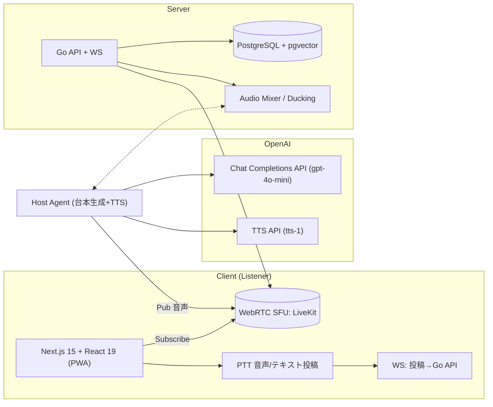

# 変更サマリ（放送型への要点）

* **常時発話の"ホスト・エージェント"**をサーバ側で**24時間起動**し、音声トラックを**配信（Publish）**。
* 視聴者は**そのトラックを購読（Subscribe）**するだけで**即"今この瞬間"に合流**（巻き戻しなし）。
* 視聴者の**PTT 入力はキュー化**し、**優先度制御＋ダッキング**で**ホストへ割り込み**（質問→応答→復帰）。
* アーキは**WebRTC SFU（LiveKit など）**を中継に据え、**OpenAI API**（Chat Completions + TTS）**で台本生成と音声合成**を実行。
* **Host Agent**が**独自に台本を生成**し、**TTSで読み上げ**て**24時間連続放送**を実現。

## 実装状況

### ✅ 実装済み

* **Host Service**: 台本自動生成、TTS音声生成、LiveKitへの音声配信、対話モード（OpenAI Realtime API）、音声ミキシング、キュー監視
* **API Service**: PTT WebSocket、Broadcast WebSocket、LiveKitトークン発行、投稿キュー管理、対話状態管理
* **Web Frontend**: LiveKit接続、PTT機能、対話モード、音声録音・送信、番組情報表示、リアルタイム音声処理
* **データベース**: 投稿管理、ベクトル検索、チャンネル管理、スケジュール管理、キュー管理
* **Audio Mixer**: ホスト音声とユーザー音声のミキシング（LiveKit内で実装）
* **Queue Priority**: PTT投稿の優先度制御（対話リクエストは高優先度）

### 🔄 開発中

* **Recording**: 放送録音・クリップ生成

### 📋 計画中

* **Multi-channel**: 複数チャンネル対応
* **SIP Integration**: 電話回線統合
* **Advanced Analytics**: 詳細分析機能

---

# 全体アーキテクチャ（放送型 v2）



**ポイント**

* **Host Agent**（常時発話 AI）は**サーバ側で常駐**。**OpenAI API**（Chat Completions + TTS）で**台本生成と音声合成**を実行し、**音声アウト**を**SFUへ Publish**。
* **Listener**は**SFUに接続して即再生**。各ユーザーが OpenAI に直接張らないので**コストとスケールが安定**。
* **PTT**は**Go API に集約**→**発話順序の仲裁（Queue）**→**Host へ順次注入**。**Mixer**で**BGM/ジングル/ダッキング**を制御。
* **Host Agent**が**独自に台本を生成**し、**8つのトピックを循環**して**30秒ごとに自動発話**。

---

# 主要コンポーネント（新規/変更）

## 1) Host Agent（常時発話 AI）

* **役割**：24時間しゃべり続ける"パーソナリティ"。
* **実体**：サーバ内プロセス（Go）＋ OpenAI API（Chat Completions + TTS）への**HTTP接続**。
* **発話継続の工夫**

  * **台本自動生成**：8つのトピック（天気、ニュース、音楽等）を**30秒ごと**に循環して台本を生成。
  * **TTS音声合成**：生成された台本を**OpenAI TTS API**で音声に変換。
  * **無音回避**：質問が無い時は**自動生成された台本**で自然に喋る。
  * **フェイルオーバ**：API エラー時は**フォールバック用の簡単なメッセージ**で復帰アナウンス。

## 2) 台本生成システム

* **トピック管理**：8つの固定トピック（天気予報、最新ニュース、音楽の話題等）を**循環**して使用。
* **プロンプト生成**：各トピックに対して**ラジオDJとして30秒程度**の内容を生成するプロンプトを作成。
* **API連携**：**OpenAI Chat Completions API**（GPT-4o-mini）を使用して**自然で親しみやすい**台本を生成。
* **品質管理**：生成された台本は**フォールバック機能**により、API エラー時でも**基本的なメッセージ**を提供。

## 3) Audio Mixer / Ducking

* **機能**：ホスト発話を**常時 Publish**、**PTT 受話時は自動ダッキング**（-12〜-18dB）し、**Q\&A**をミックス。
* **実装**：

  * **SFU 側ミキサ**（LiveKit の RoomComposite / サーバメディア処理）
  * or **サーバ内 GStreamer/FFmpeg** で**ホスト音声**と**コーラー音声**を**合成→単一配信**。
* **利点**：**1トラック配信**で**視聴者台数に依存せず安定**、録音・クリップ化も容易。

## 4) PTT Ingress（投稿キュー）

* **PTT（音声/テキスト）**→**/ws/ptt**へ送信→**Queue**へ
* **優先度**：電話>招待ユーザー>一般、**最大同時 1 名**（放送品質維持）
* **ホスト割り込み**：進行ステートが`QANDA`のときのみ割り込み許可等、**状態機械で仲裁**。

---

# セッション/配信の具体

* **OpenAI API**は**HTTP接続**で**台本生成とTTS音声合成**を実行。

  * **Chat Completions API**（GPT-4o-mini）で**30秒ごと**に台本を生成。
  * **TTS API**（tts-1）で**生成された台本を音声に変換**。
  * **Host Agent**が**独自にトピックを管理**し、**自動で台本生成とTTS実行**。
* **Listener**は**OpenAI へ接続しない**。**SFU**（LiveKit）に**Subscribe**だけ。

  * モバイル/ブラウザ双方で**超低遅延（\~200–400ms）**。
  * 視聴者数増でも**Host セッションは 1**なので**コスト一定**。

---

# API/イベント設計（増分）

```http
# LiveKit/SFU の Join Token を発行
POST /v1/room/join
- auth済 → {token, url, room:"radio-24", subscribeOnly:true}

# PTT WebSocket（音声・テキスト投稿）
WS /ws/ptt
- {type:"ptt", kind:"audio"|"text", text?}
- {type:"dialogue_request", kind:"dialogue"}
- {type:"dialogue_end", kind:"dialogue"}
- {type:"input_audio_buffer.append", audio:"base64"}
- {type:"input_audio_buffer.commit"}

# Broadcast WebSocket（リアルタイム通知）
WS /ws/broadcast
- {type:"dialogue_ready", id:"request_id"}
- {type:"dialogue_ended", reason:"timeout"|"client_disconnected"}

# 投稿管理
POST /v1/submission
- {text:"投稿内容", type:"text"|"audio"}

# テーマ管理
POST /v1/theme/rotate
- {title:"テーマ名", color:"#hex"}

# キュー管理
GET /v1/queue/peek
POST /v1/queue/dequeue
- {id:"item_id"}

# 対話状態確認
GET /v1/dialogue/status
- {active:boolean, requested:boolean}

# ブロードキャスト通知
POST /v1/broadcast
- {type:"message_type", ...data}
```

**内部イベント（Server → Host/Director/Mixer）**

* `EVENT.PTT_ENQUEUED` / `EVENT.PTT_DEQUEUED` / `EVENT.PTT_TIMEOUT`
* `EVENT.TOP_OF_HOUR`（時報）/ `EVENT.SEGMENT_TICK`
* `EVENT.MIXER_DUCK_ON` / `EVENT.MIXER_DUCK_OFF`
* `EVENT.RT_RECONNECTED`

---

# データモデル（実装済み/追加予定）

## 実装済みテーブル

```sql
-- 投稿管理
CREATE TABLE submission (
    id UUID PRIMARY KEY DEFAULT gen_random_uuid(),
    user_id TEXT,
    type TEXT CHECK (type IN ('text','audio')) NOT NULL,
    text TEXT,
    embed VECTOR(1536),  -- OpenAI埋め込みベクトル
    created_at TIMESTAMPTZ DEFAULT now()
);

-- ベクトル検索用インデックス
CREATE INDEX submission_embed_hnsw
ON submission USING hnsw (embed vector_cosine_ops);

-- チャンネル管理
CREATE TABLE channel (
    id UUID PRIMARY KEY DEFAULT gen_random_uuid(),
    name TEXT NOT NULL UNIQUE,
    live BOOLEAN DEFAULT true,
    started_at TIMESTAMPTZ DEFAULT now()
);

-- スケジュール管理
CREATE TABLE schedule (
    id UUID PRIMARY KEY DEFAULT gen_random_uuid(),
    channel_id UUID REFERENCES channel(id) ON DELETE CASCADE,
    hour INTEGER CHECK (hour >= 0 AND hour <= 23),
    block TEXT CHECK (block IN ('OP', 'NEWS', 'QANDA', 'MUSIC', 'TOPIC_A', 'JINGLE')) NOT NULL,
    prompt TEXT,
    created_at TIMESTAMPTZ DEFAULT now()
);

-- キュー管理
CREATE TABLE queue (
    id UUID PRIMARY KEY DEFAULT gen_random_uuid(),
    user_id TEXT,
    kind TEXT CHECK (kind IN ('audio', 'text', 'phone')) NOT NULL,
    text TEXT,
    meta JSONB,
    enqueued_at TIMESTAMPTZ DEFAULT now(),
    status TEXT CHECK (status IN ('queued', 'live', 'done', 'dropped')) DEFAULT 'queued'
);

-- インデックス
CREATE INDEX idx_schedule_channel_hour ON schedule(channel_id, hour);
CREATE INDEX idx_queue_status_enqueued ON queue(status, enqueued_at);
CREATE INDEX idx_queue_meta_priority ON queue USING GIN (meta);
```

## 追加予定テーブル

```mermaid
erDiagram
  USER ||--o{ SUBMISSION : makes
  CHANNEL ||--o{ CLIP : has
  CHANNEL {
    uuid id PK
    text name        // "Radio-24"
    bool live        // 常時 true
    timestamptz started_at
  }
  SCHEDULE {
    uuid id PK
    uuid channel_id
    int hour        // 0..23
    text block      // "OP","NEWS","QANDA","MUSIC"
    text prompt     // 進行用ガイダンス
  }
  QUEUE {
    uuid id PK
    uuid user_id
    text kind       // audio|text|phone
    text text       // transcript
    jsonb meta      // priority, phoneNumber等
    timestamptz enqueued_at
    text status     // queued|live|done|dropped
  }
```

* **CHANNEL**：将来チャンネル増やす下地（音楽枠/英語枠など）
* **SCHEDULE**：**Program Director**の台本/ガイダンスの**時間割**
* **QUEUE**：PTT 入力の**優先度と状態管理**

---

# 進行プロンプト例（常時発話用・要約）

> システム：あなたは24時間ラジオのメインパーソナリティ。放送は切れ目なく続く。
> いまのテーマ：{theme}、このセグメント：{segment}（残り{mm\:ss}）。
> 投稿キュー：{top3}（名前/要約/優先度）。
> ルール：
>
> * 無音を作らない。**15秒以上の沈黙は禁止**。
> * 聴き取りやすい**短文**で、**要約を字幕**に残す。
> * Q\&A中は**回答→要約→次Q**の順。
> * セグメント終了30秒前に**クロージング**、時報で**次テーマ宣言**。
> * NGワード/個人情報は読み上げない。
> * エラー時は「機材トラブル」と一言入れてから復旧。

---

# フロント実装状況

* **/on-air**：

  * **Subscribe-only Join**（LiveKit Token を API から取得→即再生）
  * **PTT ボタン**：押下中のみ録音→`/ws/ptt` へ送出
  * **対話モード**：AI DJとのリアルタイム対話機能
  * **音声録音・送信**：WebM→PCM16変換、Base64エンコード
  * **NowPlaying/字幕/視聴者数**を WS で表示
  * **テーマ切替**：時間帯に応じたテーマ変更
* **/submit**：テキスト投稿→Queue
* **/clips**：録画から1分ダイジェスト（自動）

---

# 実装ステップ（最速デモ導線）

1. **LiveKit(SFU) 部署** → **Server Publisher** を立てて**ダミーTTS**を常時配信
2. **Host Agent** を Realtime へ接続し、**番組ガイダンスで独り喋り**開始
3. **Listener Join** 実装（Subscribe Only）→**即再生**
4. **PTT Queue** → **割り込み回答**（Mixer ダッキング）
5. **毎正時テーマ切替**（UI色/ジングル/発話トピック）
6. **クリップ自動生成**（24連ショート）

---

# 運用・可用性

* **監視**：Host 心拍（10s ping）、RT 再接続／LiveKit Track 再公開
* **冗長**：**ホットスタンバイ Host**（片方ミュート、フェイル時に切替）
* **コスト**：視聴者増は**SFU 横スケール**で吸収、**OpenAI 接続は1**で安定
* **法務**：投稿の**モデレーション**、録音の**同意**（画面上に掲示）

---

# サンプル：Go（概念コード・重要部のみ）

```go
// PTTをキューへ
type PTTMsg struct {
  UserID string `json:"user_id"`
  Kind   string `json:"kind"`  // "audio"|"text"|"phone"
  Text   string `json:"text,omitempty"`
  // audio は別チャネルで受け取りASR
}

func (h *WSHandler) OnPTT(msg PTTMsg) {
  // 優先度付与 → Queueへ
  // 状態がQANDAの時だけDEQUEUEしてHostへ inject
}

// ディレクターのティック
func (d *Director) Tick(now time.Time) {
  if topOfHour(now) { d.SwitchTheme(now.Hour()) }
  d.advanceSegment()
  d.pushNowPlayingToUI()
  d.updateHostPrompt()
}
```

---

# なぜこの方式が“放送”に最適か

* **常時発話**は**1人（1セッション）**のほうが**途切れず安定**。
* 視聴者は**SFUに合流**するだけで“今”を聴ける＝**ラジオ体験**。
* **PTT 割り込み**を**Queue と状態機械**で整理できるので、**品位のある生放送**に。
* **録音・名場面抽出**が**1本の配信トラック**から容易。

---

# マイグレーション指針（元仕様 → 放送型）

1. **WebRTC 直 to OpenAI（各視聴者）**を**廃止**し、**サーバ常駐 Host → SFU 配信**へ一本化
2. **Ephemeral 発行 API**は**LiveKit Join Token API**へ置き換え
3. **毎正時テーマ**は Realtime へのインライン指示ではなく、**Director が一元管理**
4. **pgvector**は**投稿類似／ハイライト選定**に継続使用
5. **SIP/電話**は**Server→SFU の別 Publisher**として取り込み、**Queue 優先度＝最上位**に設定
